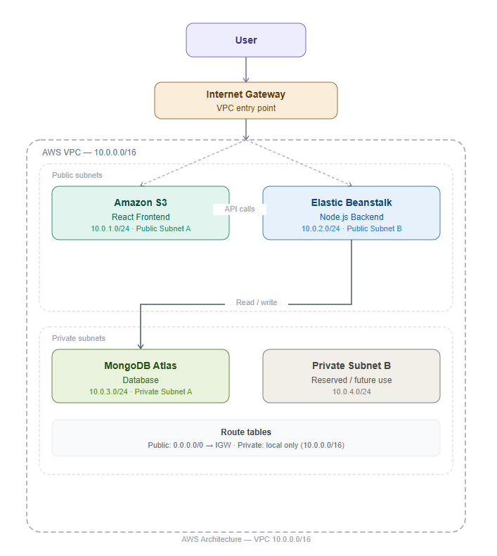

# AWS 3-Tier Web Application

A full-stack web application deployed on AWS using a 3-tier architecture. The project consists of a React frontend, a Node.js/Express backend, and MongoDB Atlas as the database.

---

## Project Overview

This application demonstrates the deployment of a scalable web application on AWS using industry-standard cloud architecture principles.

The application includes:

- User Registration
- User Login
- Dashboard
- MongoDB Database Integration
- AWS Elastic Beanstalk Deployment
- AWS S3 Static Website Hosting

---

## Architecture

### Components

Frontend:
- React.js
- AWS S3 Static Website Hosting

Backend:
- Node.js
- Express.js
- AWS Elastic Beanstalk

Database:
- MongoDB Atlas

Networking:
- Custom AWS VPC
- Public Subnets
- Private Subnets
- Internet Gateway
- Route Tables

---

## Architecture Diagram



---

## Technology Stack

| Layer             | Technology        |
|-------------------|-------------------|
| Frontend          | React.js          |
| Backend           | Node.js           |
| API Framework     | Express.js        |
| Database          | MongoDB Atlas     |
| Cloud Provider    | AWS               |
| Backend Hosting   | Elastic Beanstalk |
| Frontend Hosting  | Amazon S3         |
| Version Control   | Git & GitHub      |

---

## Project Structure

```text
aws-3tier-interview-assignment/

├── frontend/
│   ├── src/
│   ├── public/
│   └── package.json
│
├── backend/
│   ├── config/
│   ├── models/
│   ├── routes/
│   ├── server.js
│   └── package.json
│
├── architecture/
│   └── aws-3tier-architecture.png
│
├── docs/
│   └── screenshots/
│
└── README.md
```

---

## Application Features

### User Registration

Users can register with:

- Username
- Email
- Password

### User Login

Registered users can authenticate using:

- Email
- Password

### Dashboard

The dashboard displays:

- User information
- Total users
- Application statistics

---

## AWS Deployment

### Frontend

Hosted on:

- Amazon S3 Static Website Hosting

### Backend

Hosted on:

- AWS Elastic Beanstalk

### Database

Hosted on:

- MongoDB Atlas

---

## Live Application

### Frontend URL

Replace with your S3 URL:

```text
http://aws-3tier-frontend-piyush.s3-website.ap-south-1.amazonaws.com/#/
```

### Backend URL

Replace with your Elastic Beanstalk URL:

```text
http://aws-3-tier-backend-new-env.ap-south-1.elasticbeanstalk.com/health
```

---

## Local Setup

### Clone Repository

```bash
git clone https://github.com/piyushw09/AWS-3Tier-Task.git
```

### Backend Setup

```bash
cd backend

npm install

npm run dev
```

Create: This MONGO_URI is inside /docs/.env file.

```env
MONGO_URI=<your_mongodb_connection_string>
```

### Frontend Setup

```bash
cd frontend

npm install

npm run dev
```

---

## Screenshots

Application screenshots can be found inside:

```text
docs/networking/
```

---

## Author

Piyush Wadatkar

AWS Cloud & DevOps Enthusiast
